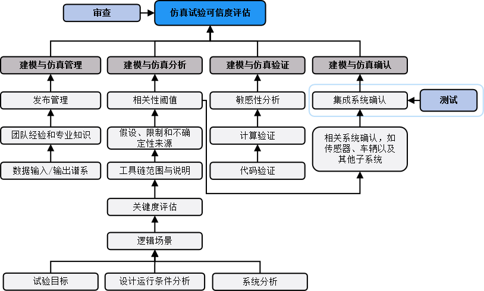
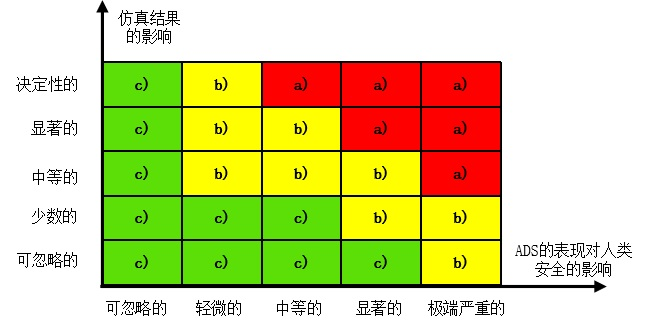

## 附录B （规范性） 仿真试验可信度评估要求

### B.1 仿真试验可信度评估框架

仿真试验可信度评估框架与流程如图B.1所示，由建模与仿真管理、分析、验证与确认四个部分组成。

  
   
  <strong>图B.1 可信度评估框架与流程示意图</strong>

### B.2 建模与仿真管理

#### B.2.1 仿真试验工具链管理流程

应建立仿真试验工具链管理流程，对仿真试验工具链的发布内容进行监控与记录，至少包括：

> a) 仿真试验工具链的每个发布版本的修改内容；

> b) 仿真试验工具链的相应软件和硬件配置；

> c) 批准仿真试验工具链的新发布版本的内部检查过程。

#### B.2.2 发布管理

**B.2.2.1** 应存储仿真试验工具链的所有支撑检查的发布版本。

**B.2.2.2** 应记录模型的确认方法和阈值。

**B.2.2.3** 应确保可将生成的数据追溯到相应仿真试验工具链版本。

**B.2.2.4** 在仿真试验工具链的整个发布和生命周期中，应确保数据完整、准确和一致。

#### B.2.3 团队的经验和专业知识

**B.2.3.1** 在组织层面，应建立、维护和记录以下过程：

> a) 岗位能力鉴定和评价的过程；

> b) 用于指导仿真试验相关人员履行职责的培训过程。

**B.2.3.2** 在团队层面，应具备说明文件，并确保：

> a) 负责仿真试验工具链确认的个人或团队具备足够的经验和专业知识；

> b) 负责组合驾驶辅助系统仿真试验的个人或团队具备足够的经验和专业知识。

**注：** 可能通过记录上述个人或团队已接受充分培训以履行其职责的方式说明。

#### B.2.4 数据输入谱系

**B.2.4.1** 在仿真试验工具链输入的数据中，应确保用于确认仿真试验工具链的数据的可追溯性。

**B.2.4.2** 应记录用于确认模型的数据，并注明相应数据的重要质量特征。

#### B.2.5 数据输出谱系

**B.2.5.1** 在仿真工具链输出的数据中，应确保用于确认组合驾驶辅助系统或子系统的数据的可追溯性。

**B.2.5.2** 应提供任何在仿真试验工具链确认过程中的输出数据的信息和场景的信息。

**B.2.5.3** 应保证仿真试验工具链的输出数据能够追溯到相应的仿真设置。

**B.2.5.4** 仿真试验工具链的输出数据应足够广泛，应充分反映组合驾驶辅助系统的设计运行条件。

**B.2.5.5** 仿真试验工具链的输出数据应支持对模型进行一致性或完整性检查。

**B.2.5.6** 若仿真试验工具链中存在随机模型，应确保具备重复执行随机模型后得到相同输出的可能，随机模型应以方差为特征。
   
   
### B.3 建模与仿真分析

#### B.3.1 通则

**B.3.1.1** 建模与仿真分析的目的是为了定义整个仿真试验方案并确定可用于仿真试验的参数空间，仿真试验工具链的范围和局限性，以及可能影响建模与仿真结果的不确定性来源。

> **注：** 不确定性指描述一个系统的时间演化不可以精确地预测，并且输入某个特定系列的激励不会始终产生相同的输出结果。

**B.3.1.2** 应提供仿真试验目的的说明。

**B.3.1.4** 应具备完整仿真试验工具链的说明，以及如何利用仿真数据支持组合驾驶辅助系统验证和确认方案的说明。

#### B.3.2 关键性评估

**B.3.2.1** 应对仿真试验进行关键性评估。关键性评估应考虑：

> a) 组合驾驶辅助系统的表现对人类安全的影响，例如GB/T 34590中的严重度等级；

> b) 仿真结果的影响，例如对工程决策的影响程度。

**B.3.2.2** 根据关键性评估的结果，仿真试验可分为三种情况，如图B.2所示：

> a) 严格遵守可信度评估；

> b) 评审决定是否遵守完整的可信度评估；

> c) 不需要遵守可信度评估。

  
   
  <strong>图B.2 关键性评估矩阵示意图</strong>

 #### B.3.3 仿真试验工具链范围与说明

 **B.3.3.1** 应说明模型明确的适用范围。

 **B.3.3.2** 应使用专用场景验证仿真模型，专用场景应足以确保仿真试验工具链在其他仿真试验场景下的表现一致。

 **B.3.3.3** 应提供用于确认仿真试验工具链的场景清单及其相应参数的限制。

 **B.3.3.4** 应针对组合驾驶辅助系统设计运行条件进行分析，并说明仿真试验工具链足够满足组合驾驶辅助系统的仿真验证需求。

#### B.3.4 假设、限制和不确定性来源

**B.3.4.1** 应提供指导仿真试验工具链设计的建模假设条件，至少包含：

> a) 应说明建模假设如何影响仿真试验工具链的使用限制；

> b) 应说明模型要求的保真度。

> **注：** 保真度指模型与建模对象的相似程度。

**B.3.4.2**  应证明仿真和实体的相关性容差符合仿真试验目的。

**B.3.4.3**  应说明模型内的不确定性来源，并说明不确定性来源对模型输出的影响。

#### B.3.5 相关性阈值

**B.3.5.1** 应确认相关性阈值的要求，相关性阈值可通过关键性能指标（KPI）来表示。

### B.4 建模与仿真验证

#### B.4.1 通则

**B.4.1.1** 仿真试验工具链验证包括对建立仿真试验工具链的原理或数学模型进行正确响应分析。仿真试验工具链验证可通过确保仿真试验工具链不会因为一系列无法测试的输入而有不现实的表现来提升仿真试验的可信度。

**B.4.1.2** 仿真试验工具链的验证应至少包含代码验证、计算验证和敏感性分析。

> **注：** 可以根据关键性评估结果选择执行相应的仿真试验工具链验证内容。

#### B.4.2 代码验证

代码验证与试验执行相关，应证明模型没有受到数字或逻辑缺陷干扰。

#### B.4.3 计算验证

**B.4.3.1** 计算验证涉及对仿真试验工具链产生影响的数值误差估计，数值误差应保持在一定的范围内且不影响验证结果。

#### B.4.4 敏感性分析

敏感性分析应至少包含：

> a) 证明影响仿真输出的最关键参数已经完成敏感性分析，例如观测仿真模型参数的扰动；

> b) 证明为提高所开发仿真试验工具链的可信度，在识别和校准关键参数时采用了鲁棒校准程序。

> **注1：** 敏感性分析旨在量化模型输入值的变化对模型输出值的影响，基于此筛选出对仿真模型结果影响最大的参数。敏感性分析也可以确定当参数发生微小变化时，仿真模型是否符合阈值约束。

> **注2：** 敏感性分析结果有助于定义需要特别注意其不确定性特征的输入和参数，以便正确定义仿真结果的不确定性。

### B.5 建模与仿真确认

#### B.5.1 通则

仿真试验工具链确认的目的是为了定量确定模型与仿真过程代表真实世界的准确程度。

#### B.5.2 性能观测量

性能观测量在建模与仿真分析时确定，应至少包括以下一种：

> a) 离散值分析，例如检测率等；

> b) 时间演化分析，例如位置、速度、加速度等；

> c) 状态变化分析，例如预碰撞时间（TTC）计算、制动启动时刻等。

> **注：** 性能观测量是用来比较仿真模型的输出量与现实世界表现的观测量。

#### B.5.3 拟合度评估

**B.5.3.1** 应通过关键性能指标(KPI)表明真实世界数据与仿真数据之间的统计可比性。

**B.5.3.1** 确认结果应表明关键性能指标(KPI)符合相关性阈值要求。

#### B.5.4 确认方法

**B.5.4.1** 应定义用于确认仿真试验工具链的逻辑场景，并确保逻辑场景应能最大程度覆盖使用仿真试验进行验证的组合驾驶辅助系统设计运行条件。

**B.5.4.2** 具体的确认方法应取决于仿真试验工具链的结构和目标。其中确认对象可包含以下一条或多条内容：

> a) 确认子系统模型，例如环境模型（路网、天气条件、目标物交互等）、传感器模型（毫米波雷达、激光雷达、摄像头等）、车辆模型（转向、制动、动力系统等）等；

> b) 确认车辆系统（车辆动力学模型和环境模型等）；

> c) 确认传感系统（传感器模型和环境模型等）；

> d) 确认集成系统（传感器模型、环境模型和车辆模型等）。

#### B.5.5 确认范围

仿真试验工具链的确认范围应包含仿真试验可信度评估涉及的全部仿真试验工具及其相关模型。

**注：** 一套仿真试验工具链包含一套或多套仿真试验工具，每套仿真试验工具可能涉及多个模型。

#### B.5.6 确认结果的记录与检查

应提供过程记录文件，包含：

> a) 仿真模型确认的相关证明；

> b) 证明仿真试验工具链整体可信的有效信息。

> **注1：** 文件中的部分内容可能通过索引历史仿真试验可信度评估记录中的内容。

> **注2：** 检查人员在此基础上可能进行完整集成仿真试验工具链的物理测试。

#### B.5.7 不确定性特征

**B.5.7.1** 应提供不确定性特征相关文件。

**B.5.7.2** 应量化模型的不确定性，并根据模型的不确定性，在通过仿真试验进行组合驾驶辅助系统确认时引入适当的安全裕度。

> **注：** 模型的不确定性通常是由A.5.7.1中的不确定性通过仿真试验工具链传递后导致的。

### B.6 文件要求

**B.6.1** 应提供仿真可信度评估文件，至少包含：

> a) 本附录中提到的仿真试验可信度要求及其证据；

> b) 仿真试验工具链的发布版本以及相关数据的说明；

> c) 文件与仿真试验工具链、数据之间的溯源关系。

**B.6.2** 文件应在仿真试验工具链的整个使用生命周期内保存。