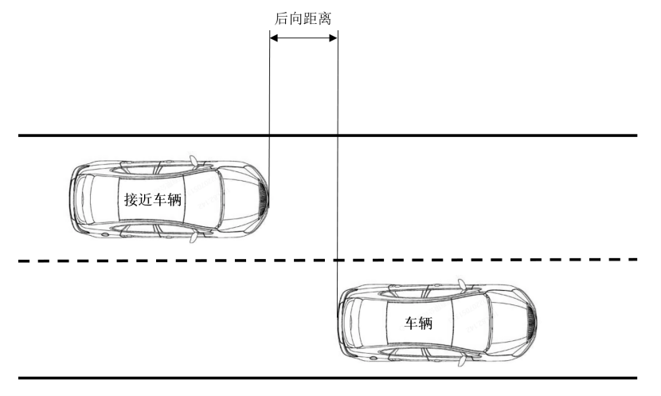

## 3. 术语和定义

GB/T 40429、GB/T 44461.1、GB/T 44461.2、GB/T 34590.1界定的以及下列术语和定义适用于本文件。

### 3.1

**组合驾驶辅助系统 combined driver assistance system**

能够辅助驾驶员持续地执行车辆横向和纵向运动控制等部分动态驾驶任务的硬件和软件所共同组成的系统。

**注：** 在不引起混淆的情况下，本文件中的“组合驾驶辅助系统”简称为“系统”。

### 3.2

**组合驾驶辅助功能 combined driver assistance function**

组合驾驶辅助系统在特定的设计运行条件内辅助驾驶员执行部分动态驾驶任务的功能。

**注：** 在不引起混淆的情况下，本文件中的“组合驾驶辅助功能”简称为“功能”。

### 3.3

**车道巡航控制功能 lane cruise manoeuvre function**

根据车辆周边行驶环境，对车辆持续进行横向和纵向运动控制，辅助驾驶员控制车辆在车道内或无车道边线的道路上巡航行驶的功能。

### 3.4

**非车道巡航控制功能 non-lane cruise manoeuvre function**

根据车辆周边行驶环境，对车辆持续进行横向和纵向运动控制，辅助驾驶员使车辆至少部分地离开本车道或改变行驶方向的功能。

**注：** 驾驶员触发的换道控制、驾驶员确认的换道控制、系统触发的换道控制、跨车道线障碍物绕行、路口通行（直行、左转弯、右转弯、掉头）、环岛通行（驶入、环行、驶出）功能属于非车道巡航控制功能。

### 3.5

**驾驶员触发的换道控制功能 driver-initiated lane change function**

在驾驶员触发换道过程后，根据车辆周边行驶环境，对车辆持续进行横向和纵向运动控制，辅助驾驶员在车道间执行换道过程的功能。

### 3.6

**驾驶员确认的换道控制功能 driver-confirmed lane change function**

在驾驶员对系统发出的换道意图进行确认后，根据车辆周边行驶环境，对车辆持续进行横向和纵向运动控制，辅助驾驶员在车道间执行换道过程的功能。

### 3.7

**系统触发的换道控制功能 system-initiated lane change function**

在系统发出换道意图后，若驾驶员没有取消，则根据车辆周边行驶环境，对车辆持续进行横向和纵向运动控制，辅助驾驶员在车道间执行换道过程的功能。

### 3.8

**跨车道线障碍物绕行功能 navigating around obstacle by lane crossing function**

当本车道内存在阻碍车辆向前行驶的障碍物或其他道路使用者时，根据车辆周边行驶环境，对车辆持续进行横向和纵向运动控制，辅助驾驶员控制车辆跨越车道边线行驶，在避免碰撞风险后回到原车道的功能。

### 3.9

**风险减缓功能 risk mitigation function；RMF**

在驾驶员持续不响应驾驶员脱离提示或警告信号的情况下，根据车辆周边行驶环境，对车辆持续进行横向和纵向运动控制，辅助驾驶员将车辆停在目标停车区域内的功能。

### 3.10

**驾驶员脱离 driver disengagement**

由系统确认的驾驶员当前无法安全地执行相应的动态驾驶任务的状态。

**注：** 驾驶员脱离包括手部脱离和视线脱离。

### 3.11

**手握方向盘提示 hands on request；HOR**

用来提示驾驶员手握方向盘的信号。

### 3.12

**视线回归提示 eyes on request；EOR**

用来提示驾驶员将视觉注意力回归到驾驶任务相关区域的信号。

### 3.13

**立即控制警告 direct control alert；DCA**

用来提示驾驶员至少立即恢复执行车辆横向运动控制的信号。

### 3.14

**设计运行范围 operational design domain；ODD**

系统设计时确定的适用于其功能运行的外部环境条件。

**注：** 典型的外部环境条件有道路、交通、天气、光照等。
[来源：GB/T 40429-2021，2.11，有修改]

### 3.15

**设计运行条件 operational design condition；ODC**

系统设计时确定的适用于其功能运行的各类条件的总称，包括设计运行范围、车辆状态、驾乘人员状态及其他必要条件。

[来源：GB/T 40429-2021，2.12，有修改]

### 3.16

**车道 lane**

不需要改变行驶路径的没有任何固定障碍物干扰的行驶区域。

[来源：GB/T 44461.1-2024，3.2]

### 3.17

**车道边线**

用于确定车道边界的可见道路交通标线。

[来源：GB/T 44461.1-2024，3.3]

### 3.18

**本车道 original lane**

系统未执行任何非车道巡航控制前车辆所在的车道。

[来源：GB/T 44461.2-2024，3.3，有修改]

### 3.19

**目标车道 target lane**

车辆意图驶入的其他车道。

[来源：GB/T 44461.2-2024，3.4，有修改]

### 3.20

**目标车道边线 lane marking of target lane**

本车道与目标车道的公共车道边线。

[来源：GB/T 44461.2-2024，3.2]

### 3.21

**换道过程 lane change procedure**

从驾驶员或系统触发换道且转向信号灯首次开启，至车辆完成换道且转向信号灯自动关闭或系统发出换道完成提示信号的过程。

[来源：GB/T 44461.2-2024，3.5，有修改]

#### 3.21.1

**换道准备阶段 lane change preparation phase**

换道过程触发至车辆距目标车道最近的前轮外侧接触到本车道侧目标车道边线的阶段。

[来源：GB/T 44461.2-2024，3.5.1]

#### 3.21.2

**换道执行阶段 lane change manoeuvre phase**

车辆完成换道准备阶段至后轮完全跨越目标车道边线的阶段。

[来源：GB/T 44461.2-2024，3.5.2]

#### 3.21.3

**换道完成阶段 lane change completion phase**

车辆完成换道执行阶段至转向信号灯自动关闭或系统发出换道完成提示信号的阶段。

[来源：GB/T 44461.2-2024，3.5.3]

### 3.22

**后向距离 rear distance of vehicle and approaching vehicle**

车辆最后端与目标车道后向接近车辆最前端沿着车道延伸方向之间实时距离。

**注：** 见图1。

  
   
  <strong>图1 后向距离示意图</strong>

[来源：GB/T 44461.2-2024，3.7]

### 3.23

**感知探测范围 detection range**

考虑车载传感器在车辆生命周期内由于老化导致性能下降等情况，系统能够可靠地探测目标的距离。

### 3.24

**设计运行车速范围 designed speed range**

系统或功能设计时确定的能够处于激活状态的车速范围。

### 3.25

**驾驶员设置的最高车速 driver-set maximum speed；$V_{\text{smaxset}}$**

由驾驶员设置的系统最高运行车速。

### 3.26

**驾驶员设置的最低车速 driver-set minimum speed；$V_{\text{sminset}}$**

由驾驶员设置的系统最低运行车速。

### 3.27

**当前最高车速 current maximum speed**

系统控制下能达到的最高运行车速。

### 3.28

**可控性 controllability**

危害事件发生时，能够避免伤害的可能性。该可能性来源于驾驶员、系统行为或外部措施。

### 3.29

**驾驶员运动控制干预 driver override**

驾驶员通过车辆制造商规定的方式影响系统执行车辆横向或纵向运动控制的行为。

**示例：** 驾驶员对方向盘、制动踏板、加速踏板的有效操作。

### 3.30

**激活状态 active state**

系统或功能辅助驾驶员对车辆执行横向和纵向运动控制的状态。

[来源：GB/T 44461.1-2024，3.10，有修改]

### 3.31

**待机状态 stand-by state**

系统或功能处于开启状态且不对车辆执行任何横向或纵向运动控制的状态。

### 3.32

**开启状态 on state**

系统或功能可被用于辅助驾驶员对车辆执行横向和纵向运动控制的状态。在开启状态下，系统或功能处于待机状态或激活状态。

### 3.33

**关闭状态 off mode**

系统被阻止用以辅助驾驶员对车辆执行任何横向或纵向运动控制的状态。

### 3.34

**I型道路环境 road environment type I**

高速公路以及快速路路况下的道路环境。

### 3.35

**II型道路环境 road environment type II**

除I型道路环境以外的道路环境。

### 3.36

**安全概念 safety concept**

在系统设计时，为保障系统在故障和非故障条件下仍能安全运行，使其不会对车辆乘员和其他道路使用者造成不合理的安全风险所采取的安全措施。

**注1：** 提供部分功能或切换至备份系统可能是安全概念的一部分。

**注2：** 安全概念包括功能安全概念和预期功能安全概念。

### 3.37

**电子控制系统 electronic control system**

通过电子数据处理方式协同实现车辆控制功能的一系列单元的组合。

**注：** 该系统通常通过软件控制，由传感器、控制器和执行器等独立的功能组件构成，并通过传输链相连接。该系统可以包括机械、电子-气压及电子-液压等单元。

### 3.38

**单元 unit**

系统组件的最小划分，可组合构成可识别、分析或更换的单独实体。

### 3.39

**传输链 transmission links**

为了传输信号、运行数据或能量供给而用于连接内部单元的方式。

**注：** 通常是电子的，也可以是机械、气压、液压或光学的。

### 3.40

**控制范围 range of control**

用于定义系统可能的控制范围的输出变量。

### 3.41

**有效工作范围 boundary of functional operation**

系统能保持控制的可验证或可测量的界限范围。

### 3.42

**控制策略 control strategy**

针对特殊环境和/或运行条件（如路面状况、其他道路使用者及交通强度、恶劣天气条件等），确保系统功能稳定和安全运行的策略。

**注：** 可能包括功能的自动停用或临时性能限制（如降低最大运行速度等）。

### 3.43

**组合驾驶辅助数据记录系统 data storage system for combined driver assistance；DSSCDA**

装备在具备组合驾驶辅助功能的车辆上，在组合驾驶辅助系统激活期间具备监测、采集、存储数据功能并支持数据读取的系统。

**注1：** 激活期间涵盖从激活状态到非激活状态的过程。

**注2：** 组合驾驶辅助数据记录系统包括I型系统和II型系统。

### 3.44

**碰撞事件 impact event**

达到或超过触发阈值的碰撞或其他物理事件，或者其他任何导致不可逆约束装置展开的事件，以先发生者为准。

**注：** 行人保护装置展开或其他系统检测到的弱势道路使用者（VRU）碰撞事件属于碰撞事件。

[来源：GB 39732—2020，3.1，有修改]

### 3.45

**事件起点 starting point of event；$T_0$**

组合驾驶辅助数据记录系统确认某特定事件发生的时刻。

### 3.46

**事件终点 ending point of event；$T_\text{end}$**

组合驾驶辅助数据记录系统确认某特定事件结束的时刻。

### 3.47

**锁定 locked status**

数据无法被覆盖的状态。

### 3.48

**视场角 field viewing angle**

在摄像设备中，以摄像设备的镜头中心为顶点，被测目标的物像可通过镜头最大范围的两条边缘构成的夹角。

### 3.49

**时间段事件 time sequence event**

当满足触发条件时，围绕事件起点，记录事件起点前和事件起点后一段时间内的相关数据的事件。

### 3.50

**时间戳事件 timestamp event**

当满足触发条件时，仅记录事件起点时刻的相关数据的事件。

### 3.51

**组合驾驶辅助系统严重失效 severe combined driver assistance system failure**

组合驾驶辅助系统关键部件失效导致严重影响组合驾驶辅助系统安全运行的失效。

**示例：** 核心计算单元失效。

### 3.52

**车辆严重失效 severe vehicle failure**

任何同时影响组合驾驶辅助系统辅助驾驶员执行动态驾驶任务（DDT）能力且影响人工驾驶的车辆失效。

**示例：** 电源掉电、制动系统失效、胎压突然下降。